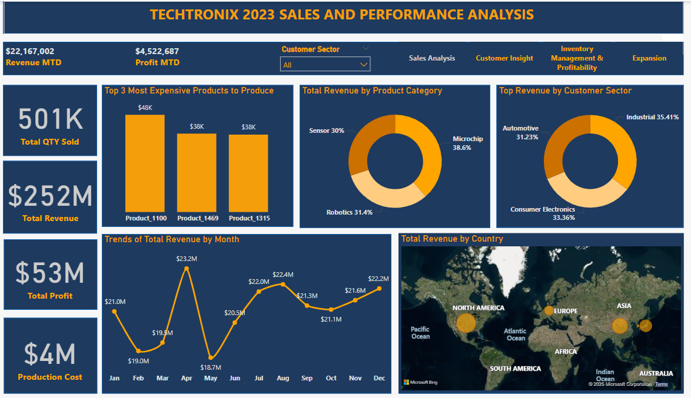
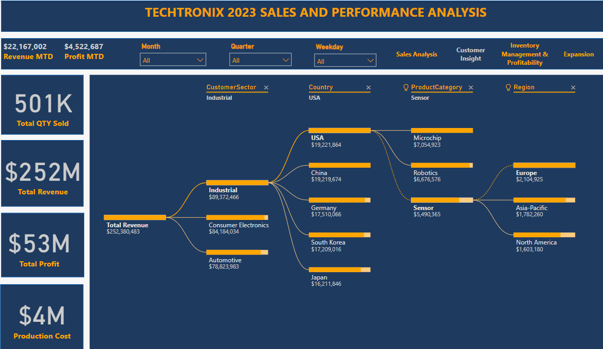
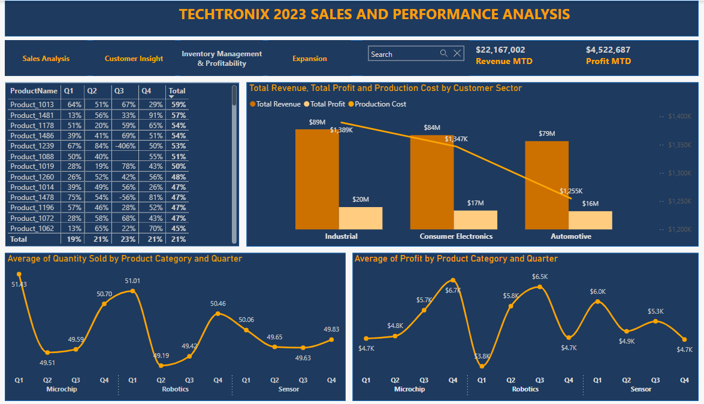
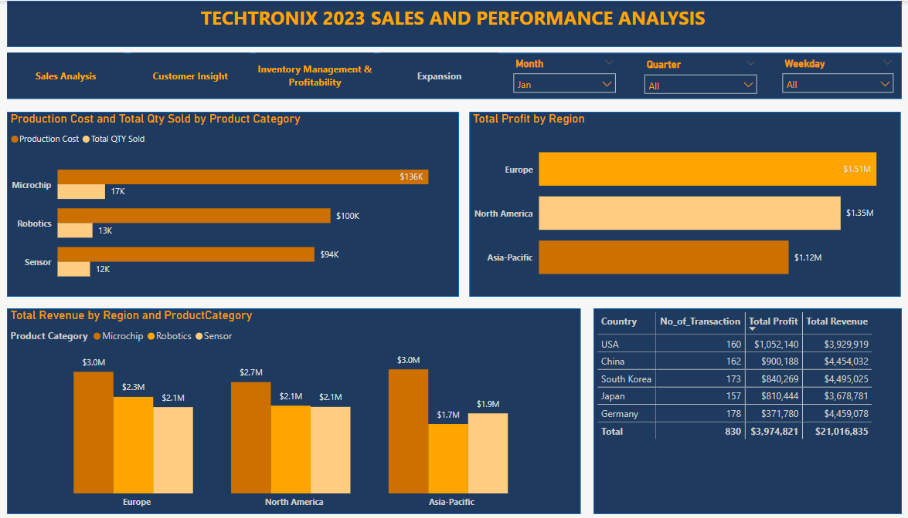

# Techtronix Market & Sales Performance Analysis

## Table of Contents
1. [Executive Summary](#executive-summary)
2. [Business Challenges](#business-challenges)
3. [Project Overview](#project-overview)
4. [Key Findings & Insights](#key-findings--insights)
    - [Sales Performance](#sales-performance)
    - [Customer Insights](#customer-insights)
    - [Inventory Optimization & Profitability](#inventory-optimization--profitability)
    - [Market Expansion](#market-expansion)
5. [Visualizations](#visualizations)
6. [Tools Used](#tools-used)
7. [Recommendations](#recommendations)

## Executive Summary
Techtronix is a leading company in the **microchip and robotics** industry, providing innovative solutions for automotive, consumer electronics, and industrial sectors. This analysis focuses on **sales trends, customer behaviour, inventory management, and market expansion opportunities** to drive strategic business growth.

## Business Challenges
- **Sales Strategy Optimization:** Sales performance varies across products, regions, and customer sectors.
- **Inventory Management Inefficiencies:** Stock levels do not align with demand, leading to inefficiencies.
- **Profitability Concerns:** High revenue does not always translate into high profits.
- **Market Expansion Difficulties:** Entering new markets presents operational and logistical challenges.

## Project Overview
### **Objective**
Gain insights into sales trends, customer behaviour, inventory performance, and market expansion across key regions.

### **Data Sources**
The dataset includes **2023 transactional records** from three regions and five countries:
- **Regions:** North America, Europe, Asia-Pacific
- **Countries:** USA, China, South Korea, Japan, Germany

### **Key Attributes**
- **Sales Data:** TransactionID, Date, ProductCategory, QuantitySold, UnitPrice, TotalSaleAmount
- **Customer Data:** CustomerSector, Country, Region
- **Financial Metrics:** ProductionCost, Profit

## Key Findings & Insights

### **Sales Performance**
- **Revenue Distribution by Product Category:**
  - Microchips (38.6%) generate the highest revenue, followed by Robotics (31.4%) and Sensors (30%).
- **Monthly Revenue Trends:**
  - **Highest revenue months:** April ($23.2M) & August ($22.4M).
  - **Lowest revenue month:** May ($18.7M).

📌 **Recommendation:** Expand microchip sales while optimizing margins for Robotics & Sensors.

### **Customer Insights**
- **Revenue by Sector:**
  - Industrial (35.4%) is the top revenue generator, followed by Consumer Electronics (33.3%) and Automotive (31.2%).
- **Regional Buying Behaviour:**
  - USA leads in Industrial sector sales ($19.22M), while China and Japan dominate in Consumer Electronics.
  - South Korea has the lowest revenue at $49.2M.

📌 **Recommendation:** Strengthen North America Consumer Electronics and expand Automotive sector in China.

### **Inventory Optimization & Profitability**
- **Total Revenue vs. Profit Margin:**
  - Industrial sector generates the highest revenue ($89M) but has lower profit margins.
  - Microchips peak in Q1, while Robotics sales are strongest in Q3.

📌 **Recommendation:** Optimize high-cost product production and adjust sales strategies in Q3 & Q4.

### **Market Expansion**
- **Total Profit by Region:**
  - Europe leads with $1.51M, followed by North America ($1.35M), while Asia-Pacific has the lowest profit at $1.12M.
- **Country-Specific Revenue:**
  - **South Korea** has the highest revenue ($4.49M) but lower profitability.
  **USA** has the highest total profit ($1.05M), which suggests that its operations are more cost-efficient compared to other regions.
  - **Japan** has the lowest revenue ($3.67M), indicating weaker market penetration.

📌 **Recommendation:** Strengthen the supply chain in South Korea and enhance cost efficiency in Germany.

## Visualizations
Below are key Power BI dashboards used in the analysis:

### **Sales Performance Dashboard**

### **Customer Insights Dashboard**

### **Inventory & Profitability Dashboard**

### **Market Expansion Dashboard**

## Tools Used
- **Power BI**: Used for data visualization and dashboard creation.
- **Excel**: Used for data cleaning and transformation.

## Recommendations
- **Expand microchip market in Asia-Pacific** by adjusting pricing strategies and forming local partnerships.
- **Boost Robotics & Sensors sales in North America** by targeting smart manufacturing and automation.
- **Strengthen market penetration in Japan** through enhanced marketing and distribution.
- **Optimize inventory management** using AI-driven demand forecasting.
- **Improve profitability in high-revenue sectors** by controlling production costs and optimizing margins.

---

This analysis provides a **data-driven strategy for Techtronix Innovations** to optimize sales, enhance profitability, and expand into new markets. By leveraging insights from transactional data, the company can refine its operations and drive long-term growth.

You can download the **Techtronix Market & Sales Analysis** PowerPoint presentation here:  
📂 [Techtronix_Analysis.pptx](Techtronix_Analysis.pptx)
